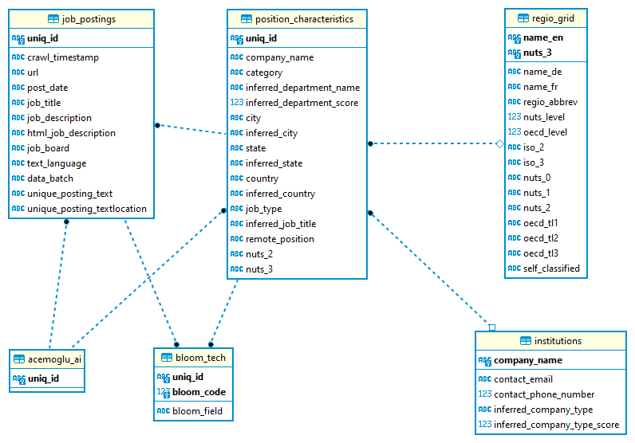

# :desktop_computer: :floppy_disk: JPOD

Source code for creating and updating the CIEB Job Postings Database (JPOD)

## What is JPOD?
JPOD hosts job adds data the CIEB first acquired in 2022 from <a href='https://www.jobspikr.com/'>jobspickr</a>. The idea of JPOD is to have an easily updateable and manageable database that allows to add further job-ads data in the future - be it from jobspickr or other data providers. 

All material related to JPOD as well as the database itself is stored on the University of Basel's [scicore cluster](https://scicore.unibas.ch/) under the directory `/scicore/home/weder/GROUP/Innovation/05_job_adds_data/`. The JPOD database can be found as an SQLite Database file (https://www.sqlite.org/) named `jpod.db` (about 68.4 GB). This repository contains the source code and scripts to interact with JPOD for maintainance, testing, updating and certain specific querying and is thus also available on sciocore under the directory `jpod/`. Finaly, a virtual environment with all the necessary dependencies is available at `jpod-venv/`. Activate this virtual environment using `source jpod_venv/bin/activate` to interact with JPOD (see also below).

Currently (i.e. August 2023), **JPOD contains 9'196'097 job postings from 21 countries and 701'828 different employers**.

## How to access JPOD?

JPOD can be easily accessed through the SQL command-line program named `sqlite3` or the respective `sqlite3` and `DBI` interfaces for Python and R, respectively. 

:warning: **IMPORTANT:** In order to experiment and test your SQL-queries, it is strongly recommended to establish a connection to `jpod_test.db` instead of `jpod.db`. `jpod_test.db` is a smaller clone of the fully specified database and contains only a random subsample of all job postings in the full database (0.2\%). It is therefore much more lightweight and you can run your experimental queries much faster and on the scicore login node (e.g., through RStudio or VSCode) instead of already using the scicore computing nodes.

The following presents three different ways to access the database and retrieve the first 5 job postings from it.

To access and query JPOD using the command line run the following:
```bash
ml load SQLite/3.35.4-GCCcore-10.3.0
cd /scicore/home/weder/GROUP/Innovation/05_job_adds_data/
sqlite3 jpod_test.db
sqlite> SELECT job_description FROM job_postings LIMIT 5;
```

To access and query JPOD using Python run the following:
```python
# import the sqlite3 package and establish a connection to the database
import sqlite3
JPOD_PATH = '/scicore/home/weder/GROUP/Innovation/05_job_adds_data/jpod_test.db'
JPOD_CON = sqlite3.connect(JPOD_PATH)
JPOD_CON.execute('SELECT job_description FROM job_postings LIMIT 5').fetchall()
```

To access and query JPOD using R run the following:
```R
# import the RSQLite and DBI packages and establish a connection to the database
library("RSQLite")
library("DBI")
JPOD_PATH <- '/scicore/home/weder/GROUP/Innovation/05_job_adds_data/jpod_test.db'
JPOD_CON <- dbConnect(RSQLite::SQLite(), JPOD_PATH)
res <- dbSendQuery(JPOD_CON, 'SELECT job_description FROM job_postings LIMIT 5')
dbFetch(res)
```

:exclamation: **Please see further examples <a href='./examples/'>here</a> for a more comprehensive introduction and different ways to query JPOD (e.g. using libraries such as pandas or dplyr).**

## JPOD Overview

**:rotating_light: The full technical docmentation** is available <a href='./docs/jpod_manual.md'>here</a>. To get a brief overview, JPOD currently consists of **6 tables**, which ecompass information along the following lines:

table|descirption
---|---
job_postings|All information surrounding the job posting itself. This particularly refers to the actual text of the posting, as well as e.g., the posting date and whether or not its text is unique in the databse.
position_characteristics|All information about the position the job posting encompasses. This refers e.g., to employers but also e.g., the region of the specified location and whether or not the posting describes a remote position.
institutions|All information about the employers that are registered in the database. This table features information regarding e.g., employer websites and contact information.
acemoglu_ai|A lists of postings that have AI-specific keywords as defined by <a href='https://www.journals.uchicago.edu/doi/full/10.1086/718327'>Acemoglu et al. (2022) (Footnote 13)</a> in the postings text.  
bloom_tech|A lists of postings that have technology-specific keywords as defined by <a href='https://www.nber.org/papers/w28999'>Bloom et al. (2020)</a> in the postings text.
regio_grid|An overview table of regional entities that are present in JPOD. This selection is motivated by Eurostat's [NUTS regions](https://ec.europa.eu/eurostat/web/nuts/background/), as well as the [OECD territorial Grid Taxonomy](https://www.oecd.org/regional/regional-statistics/territorial-grid.pdf) and can be further extended.

Below is the full schema of the 2023 JPOD version:



## Repository Struture

This repository has the following structure:
```
jpod
├── data
├── docs
├── eval
├── examples
├── jpod
├── scripts
```

- [data/](./data/): Contains data files that are used to enhance information contained in JPOD and/or to evaluate the results extracted from the dataabse. The data can either be raw data (e.g., [acemoglu_ai_keywords.txt](./data/acemoglu_ai_keywords.txt)), created manually (e.g., [regio_grid.csv](./data/regio_grid.csv)) or through scripts (e.g., [acemoglu_ai_keywords.csv](./data/acemoglu_ai_keywords.csv)).

- [docs/](./docs/): Contains files that aim to facilitate the access to and the maintainance of JPOD. You can find an extended JPOD manual [jpod_manual](./docs/jpod_manual.md) and approximate [script runtimes](./docs/runtimes.md)

- [eval/](./eval/): Contains several scritps to test the validity and representativeness of the jobspickr data.

- [examples/](./examples/): Presents some [query examples](./examples/) for R and Python. Furthermore, this contains a directory [pharma_ai](./examples/pharma_ai/) with scripts to perform an analysis regarding the share of AI-related job postings for different pharmaceutical companies.

- [jpod/](./jpod/): Contains Python modules that support configuration, maintainance, navigation and queriying of JPOD. There are 4 modules: config, datagen, navigate and queries. These can be indidually loaded using `from jpod import ...` or entirely together using `import jpod`.

- [scripts/](./scripts/): These are mainly Python scripts and some SQLite scirpts to create JPOD and enhance its inserted raw data. Furthermore there are shell/slurm scripts in [scripts/sciocre/](./scripts/scicore/) that are sending the Python scripts to the cluster. For more information see the technical [JPOD Manual](./docs/jpod_manual.md).

## Packaging and Installation

To use the JPOD functionalities for another project, the source code in this repository is also available as a **python package named `jpod`**. This makes it easier to use the code for other projects. However, the source distribution is not available on pypi and the `jpod` package must be installed locally. **jpod requires a Python version>=3.6 and setuptools>=61.0**. To ensure that on the cluster, run the following from the command line (if run locally, change the paths to the virtual environment and this repository accordingly):

```bash
ml load Python/3.9.6-GCCcore-11.2.0
python3 -m venv [YOUR_PROJECTS_VIRTUAL_ENVIRONMENT_NAME] python=3.9
source <PATH_TO_YOUR_PROJECTS_VIRTUAL_ENVIRONMENT>/bin/activate
pip install --upgrade pip
pip install --upgrade setuptools>=61.0
cd /scicore/home/weder/GROUP/Innovation/05_job_adds_data/jpod/
pip install .
```

Subsequently, verifiy the installation by importing jpod:
```python
import jpod
con = jpod.connect_to_jpod()
print(jpod.get_tables(con))
# ['job_postings', 'position_characteristics', 'institutions', 'acemoglu_ai', 'bloom_tech', 'regio_grid']
```

:warning: **IMPORTANT:** If you make changes to the package source code hosted in [jpod/](./jpod/), you must build the package from scratch and re-install the it in other projects to use such new functionalities that you added. To do this, make sure that the local repository on scicore is up to date (run `git status`, commit or restore changes and then `git pull`) and run the following code in the command line to build the new package:
```bash
cd /scicore/home/weder/GROUP/Innovation/05_job_adds_data/jpod/
rm dist/ -r
rm *egg-info/ -r
source ../jpod_venv/bin/activate
pip install --upgrade pip
pip install --upgrade build
python3 -m build
```
This code activates the jpod virtual environment, upgrades the packaging tools `pip` and `build` if necessary and then creates the package distribution files using `python3 -m build` (these files will be saved under a newly created `dist/` directory within this repository). The distribution files will be used when installing `jpod` for other projects (see above).


