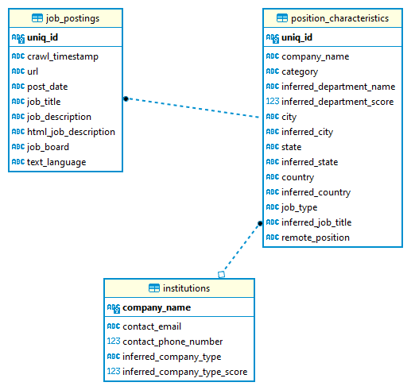
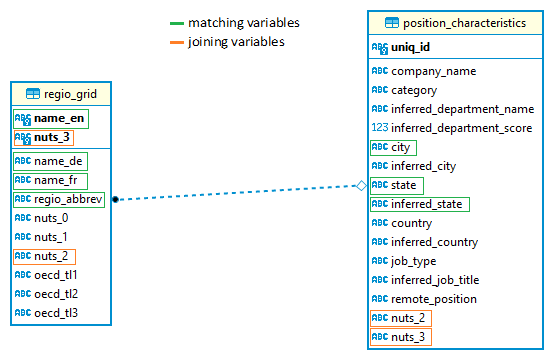

# JPOD MANUAL

JPOD is short for '**J**ob **Po**stings **D**atabase'. It hosts job adds data the CIEB first acquired in 2022 from JobsPickr. The idea of JPOD is to have an easily updateable and manageable database that allows to add further job-ads data in the future - be it from JobsPickR or other providers.

## JPOD in Brief

For now, JPOD is set up as a SQLite Database, which is one of the most common relational database management systems (RDBMS) in the world (https://www.sqlite.org/). SQLite is especially suitable for relatively 'small' databases and is easily transferable since the entire database is stored as a single file. SQLite features a lightweight command line program called 'sqlite3', which allows one to execute SQL statements from the CL. Besides, sqlite is compatible to interact with all kinds of IDEs (e.g. DBeaver, DB Browser, Beekeper Studio) and there are several libraries to directly interact with sqlite using Python and/or R.  

JPOD as well as its source code is stored on scicore in the CIEB's GROUP folder under the directory `/scicore/home/weder/GROUP/Innovation/05_job_adds_data/`. The created sqlite database is stored in the file `jpod.db` (about 17.2 GB). The source code is available in the directory `jpod/`, which is also on GitHub (https://github.com/cieb-unibas/jpod). 

Currently (i.e. January 2023), JPOD contains 3'211'219 Swiss job postings from 76'935 different institutions.

## Setting Up JPOD from scratch: 

The initial setup is performed along the lines of the 2022 JobsPickR data. JPOD builds on 26 variables from this batch of data, which are distributed across 3 different SQL tables: `job_postings`, `position_characteristics` and `institutions`. The `job_postings` table contains all information around the postings as such (e.g., the date a posting was retrieved, the posting text, the webpage it was published on). The `position_characteristics` table features information about the job postion described by the posting (e.g., the location of the position, the employers' name etc.). Finally, the table `institutions` contains information about all employers that have postings in the database (e.g., the employer's webpage, the employer's phone number etc.). This database schema, JPODs initial architecture, is defined in the file `scicore/create_jpod.sqlite`. 

### Inserting raw data to JPOD (2022 JobsPickR Data)

JPOD is set up on scicore using the slurm scirpt `scripts/scicore/jpod_launch.sh`. This scirpt implements the initial architecture of JPOD and then inserts the 2022 raw data from JobsPickr (this data can be found as zipped `.csv` files in the directory `/scicore/home/weder/GROUP/Innovation/05_job_adds_data/jobspickr_raw/`). 

Since the latter is performed using a Python script, we first need to install a Python virtual environment. Such a virtual environment can be setup via the bash script `scicore/create_venv.sh`. 
**However**, *this step is not necessary since a virtaul environment has already been created on scicore. For setting up correpsonding virtual environment on your local machine, see the documentation of either [`conda`](https://docs.conda.io/projects/conda/en/latest/user-guide/getting-started.html#managing-environments) or [`virtualenv`](https://virtualenv.pypa.io/en/latest/user_guide.html)*.

Assuming you are in the `jpod/` root directory, the file `scripts/scicore/jpod_launch.sh` can then be sent to the cluster for setting up JPOD from scratch using the command `sbatch scripts/scicore/launch_jpod.sh`. Executing this file creates the JPOD database (using the `scripts/create_jpod.sqlite` script) and then calls the python script `scripts/insert_base.py`. The latter loads the 2022 JobsPickr raw data, performs several cleaning steps to it (e.g. lowercase selected columns, distinct rows only etc.) and then inserts the cleaned raw data to the above-mentioned 3 tables of JPOD.

## JPOD Architecture: Tables and Keys

Since JPOD's initial architecture is very closely related to JobsPickR, its original setup depends on JobsPickR information. Most importantly, this concerns the column `uniq_id`, which is taken as is from the JobsPickR raw data. `uniq_id` is a identifier variable oft type `str` and length 32, consisting entirely of ASCII characters and digits. In JPOD, this column serves as a SQL primary key in the two tables `job_postings` and `position_characteristics`. These two tables can thus be connected (i.e. joined) through the column `uniq_id`. Note: For potential future updates with data acquired from other providers than Jobspickr, it might therefore be necessary to create corresponding `uniq_id`'s from scratch. The third initial table is the `institutions` table, where information about companies can be accessed. The `institutions` table is connected to the other tables through the column `company_name`, which is also featured in the `position_characteristics` table. A graphical overview of the base JPOD architecture and how different tables can be joined is presented below.

**Figure 1: ER Diagram of JPOD's base architecture**



## Enhancing JPOD

### Assigning Postings to NUTS-Regions and OECD Territorial Levels

A key feature of JPOD is to enable analyses on the regional level. To be compatible with commonly used regional taxonomies, job postings are assigned to Eurostat's [NUTS regions](https://ec.europa.eu/eurostat/web/nuts/background/), as well as the [OECD territorial Grid Taxonomy](https://www.oecd.org/regional/regional-statistics/territorial-grid.pdf). To do this, the `/jpod/add_geogrid.py` script first reads data from the (manually created) file `data/regio_grid.csv` and creates an additional JPOD overview table `regio_grid`. This table consits of columns indicating a geographical entity's name in English, German and French, its abbrevation (if it exists) and all it's NUTS and OECD TL codes (if they exist). An example of rows from this table is given below:

name_en|name_de|name_fr|regio_abbrev|nuts_level|oecd_level|iso_2|iso_3|nuts_0|nuts_1|nuts_2|nuts_3|oecd_tl1|oecd_tl2|oecd_tl3|self_classified
---|---|---|---|---|---|---|---|---|---|---|---|---|---|---|---
switzerland|schweiz|suisse|CH|1|1|CH|CHE|CH|CH0|||CH|||no
espace mittelland|espace mittelland|espace mittelland||2|2|CH|CHE|CH|CH0|CH02||CH|CH02||no
California|||||2|US|USA|||||US|US06||no
Bavaria|Bayern|||1|2|DE|DEU|DE|DE2|||DE|DE2||no
basel-stadt|basel-stadt|bâle-ville|BS|3|3|CH|CHE|CH|CH0|CH03|CH031|CH|CH03|CH031|no

The actual assignment of job postings to the stated regions in the `regio_grid` table was initially performed via the script `scripts/assign_geo.py` for Swiss job postings. Using slurm, this script can also be sent to the cluster via the `scicore/jpod_augment.sh` script. Job postings are thereby assigned a territorial code based on the columns `city`, `inferred_city`, `state`, and `inferred_state` in the `position_characteristics` table. More specifically, the script first creates two new columns, `nuts_2` and `nuts_3`, in the `position_characteristics` table (indicating the location of every job posting) and fills them with NUTS codes if values in the columns `city`, `inferred_city`, `state`, and/or `inferred_state` can be (exactly) matched to one of the values in the columns `name_en`, `name_de`, `name_fr` and/or `regio_abbrev` in the `regio_grid` table. After acquiring further data with international coverage in 2023, regional assignment for job postings was directly taken care of in the database [updating process](#updating-jpod-inserting-new-job-adds).

Hence, **geographical information for NUTS-levels 2 and 3 are directly observed in the `position_characteristics` table**. If other terrtorial information has to be retrieved (e.g. another aggregation level or the English, French or German name of the NUTS code), this can be retrieved by joining the `position_characteristics` with the `regio_grid` table. A graphical overview is given in Figure 2.

**Figure 2: ER Diagram of JPOD's regional information**

**Notes on Refined Matching**: Some job postings state their geographical information in a special way (e.g. 'baselstadt' instead of 'basel-stadt' or 'bs'). To capture these false negatives to some extent, refined matching operations were additionally performed for the largest non-matched Swiss entities via the `scripts/assign_geo.py` script. After all of these operations 92.6\% of the 3'211'219 job postings in the initial JPOD could be matched to NUTS 2 regions. 




### Duplicate Cleaning

JPOD features job postings that have distinct identifiers from Jobspickr. That means, *exact duplicates* should have been removed already before insertion to JPOD. However, there is still a substantial fraction of postings that has exactly duplicated counterparts. 

There are several possible reason for this. First, it is possible that Jobspickr's duplicate cleaning process failed to clean the duplicates. Second, it is possible that an employer published the same posting at different times (e.g., a restaurant searches for a waiter in the beginning and the end of the year), implying that it should not be treated as a duplicate. Finally, it can also be that an employer publishes the same posting at different locations (e.g., a restaurant chain searches for waiters at different locations), again suggesting that such postings should not be treated as duplicates.

JPOD takes these issues into account. The columns `unique_posting_text` and `unique_posting_textlocation` in the `job_postings` table provide the respective information. Both columns take on the value `no` if a certain posting has a counterpart with an exactly identical `job_description`. The difference between the two columns `unique_posting_text` and `unique_posting_textlocation` is that the former searches for exact duplicates in the overall database, and the latter only checks for duplicates in the same `city`. 

Hence, JPOD can be easily subsetted to unique job postings using the values of these two columns in a `WHERE` statement. For example, the following statement will extract all non-duplicated postings' uniq_id, the corresponding employer, the city and the job_description.

```sql
SELECT jp.uniq_id, pc.compay_name, pc.city, jp.job_description
FROM job_postings jp
WHERE jp.unique_posting_text == 'yes'
LEFT JOIN position_characteristics pc on jp.uniq_id = pc.uniq_id;
```

**Notes on Duplicates**: Duplicated postings are substantial in JPOD. In fact, 1'446'838 of the 3’211’219 Swiss postings in the database have at least one exact duplicate in the overall database (i.e. 45%). Think carefully what kind of data your analyses requires and set the `unique_posting_text` filters in your queries accordingly. Jobspickr improved their cleaning subsequently and these rates are normally lower in the 2023 batch of postings. There, the share of duplicates varies by country as you can see in the subsequent table:

country|number of postings in 2023 batch|number of unique postings|share of unique postings
---|---|---|---
|60||
austria|73912|42736|0.578
canada|388849|293487|0.755
china|5128|4615|0.900
denmark|30997|28346|0.914
france|196975|170986|0.868
germany|1033576|406196|0.393
hong kong|124382|115020|0.925
india|304565|282155|0.926
iran|17|15|0.882
israel|993|974|0.981
italy|188583|162312|0.861
japan|1402|1308|0.933
korea south|1064|1002|0.942
netherlands|132338|111909|0.846
russia|24746|23347|0.943
spain|48319|44128|0.913
sweden|48835|44917|0.920
switzerland|73002|61296|0.840
taiwan|15420|14516|0.941
turkey|36966|35807|0.969
united kingdom|265261|206617|0.779
united states|2989548|2429208|0.813

## Updating JPOD: Inserting New Job Adds
tbd
