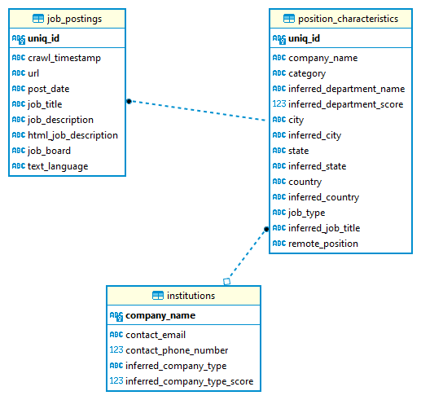

# JPOD MANUAL
JPOD is short for 'Job Postings Database'. It hosts data on job adds the CIEB first acquired in 2022 from JobsPickr. The idea of JPOD is to have an easily updateable and manageable database that allows to store further data in the future - be it from JobsPickR or other sources.

## JPOD in Brief
JPOD is set up as a SQLite Database, which is one of the most common relational database management systems (RDBMS) in the world (https://www.sqlite.org/). SQLite is especially suitable for relatively 'small' databases and is easily transferable since the entire database is stored as a single file. SQLite features a lightweight command line program called 'sqlite3', which allows to execute SQL statements from the CL. Besides, sqlite is compatible to interact with all kinds of IDEs (e.g. DBeaver, DB Browser, Beekeper Studio) and there are several solutions to directly interact with sqlite using Python and/or R libraries.  

JPOD as well as its source code is stored on scicore in the CIEB's GROUP folder under the directory `/scicore/home/weder/GROUP/Innovation/05_job_adds_data/`. The created sqlite database is stored in the file `jpod.db` (about 17.2 GB). The source code is available in the repository `jpod`, which is also on GitHub (https://github.com/cieb-unibas/jpod). 

Currently (i.e. July 2022), JPOD contains 3'211'219 Swiss job postings from 76'935 different institutions.

## Setting Up JPOD: Insert 2022 JobsPickR Data
The initial setup is performed along the lines of the 2022 JobsPickR data. JPOD builds on 26 variables that are available from JobsPickR and are split across 3 different SQL tables. This initial architecture is defined in the file `create_jpod.sqlite` that also creates the database. 

Next, the database is filled with the raw data from JobsPickR. This data can be found as zipped `.csv` files in the directory `/scicore/home/weder/GROUP/Innovation/05_job_adds_data/jobspickr_raw`. The insertion of this data is performed using a Python API. A corresponding virtual environment for navigating JPOD using scicore is set up via the bash script `create_venv.sh`. The file `insert_base.py` then performs several cleaning steps to the raw data (e.g. lowercase selected columns, distinct rows only etc.) before inserting data to the mentioned 3 base-tables of JPOD. 

All of these steps (excluding the virtual environment) are bundled in the bash script `launch_jpod.sh`. To launch JPOD, this script was sent to the scicore cluster using the command `sbatch launch_jpod.sh`. 

## JPOD Architecture: Tables and Keys
Since JPOD's architecture is very closely related to JobsPickR, its original setup depends on JobsPickR information. Most importantly, this concerns the column `uniq_id`, which is taken as is from the JobsPickR data. `uniq_id` is a identifier variable of length 32, consisting entirely of ASCII characters and digits. In JPOD, this column serves as a SQL primary key in the two tables `job_postings` and `position_characteristics`. These two tables contain information about the job posting (e.g. the text, the crawl date) and the job position (e.g. the location, the company, the region) respectively, and can be connected (i.e. joined) through the column `uniq_id` . For potential future updates from other data providers than JobsPickR, it might therefore be necessary to create `uniq_id`'s from scratch. The third and final initial table is the `institutions` table, where information about companies can be accessed. The `institutions` table is connected to the other tables through the column `company_name`, which is also features in the `position_characteristics table`. A graphical overview of the base JPOD architecture is presented below.

**Figure 1: ER Diagram of JPOD's base architecture**

## Enhancing JPOD: Inserting Regional, Industry and Country Information
tbd

## Updating JPOD: Inserting New Job Adds
tbd
